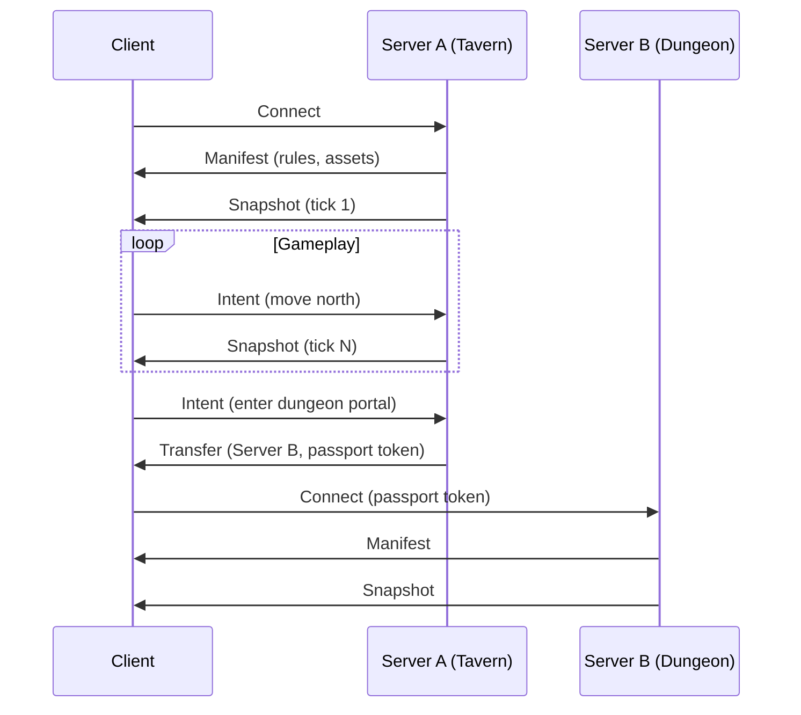

# Architecture

## Protocol Flow



## Message Types

### Manifest

Sent by server on connection. Describes what this world allows:

```rust
struct Manifest {
    world_id: WorldId,
    substrate_hash: Hash,      // Content address of static world
    allowed_items: Vec<ItemId>,
    physics_config: PhysicsConfig,
    asset_requirements: Vec<AssetRef>,
}
```

### Intent

Client requests an action:

```rust
enum Intent {
    Move { direction: Direction },
    Interact { target: EntityId },
    UseItem { item: ItemId, target: Option<EntityId> },
    Chat { message: String },
}
```

### Snapshot

Server broadcasts authoritative state:

```rust
struct Snapshot {
    tick: u64,
    entities: Vec<EntityState>,
    events: Vec<WorldEvent>,
}
```

### Transfer

Server hands off client to another server:

```rust
struct Transfer {
    destination: ServerAddress,
    passport: Passport,
    signature: Signature,
}
```

## Substrate Caching

Substrates are content-addressed and aggressively cached:

1. Client connects to Server A
2. Server sends `substrate_hash`
3. Client checks local cache
4. If miss, fetches from server or P2P
5. Verifies hash

When Server A dies, client still has substrate locally.

## Heartbeat Snapshots

Servers periodically export simulation state as new substrate versions:

1. Every N minutes, export "state of the world"
2. Push to replication layer (IPFS, S3, P2P mesh)
3. If server crashes, reconnecting clients load latest snapshot
4. User-created changes persist (as static objects)
