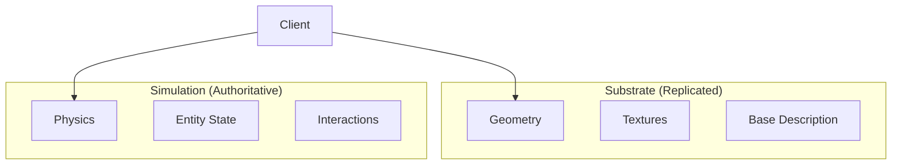

# Introduction

Hypha is a federation protocol for persistent worlds, designed for Lotus servers.

## The Problem with State Merging

Traditional federation protocols (like Matrix) try to merge state from multiple servers. This creates attack surfaces:

- **State Resolution DoS**: Craft complex conflicting events to burn CPU
- **History Rewriting**: Inject fake events into the past
- **Split-Brain Attacks**: Partition network, create conflicting realities, merge chaos

## The Hypha Solution

Don't merge. Switch.

- Server A owns the Tavern
- Server B owns the Dungeon
- When you're in the Tavern, Server A is God
- When you move to the Dungeon, you disconnect from A and connect to B

This is **Authoritative Handoff**, not Distributed State.

## Two-Layer Architecture

### Substrate

The static "definition" of the world:
- Geometry, textures, sounds
- Base room descriptions
- Content-addressable (like IPFS)
- Cacheable everywhere
- Survives server death

### Simulation

The dynamic "life" of the world:
- Physics, player positions
- Door open/closed states
- Authoritative from single server
- Not replicated
- Pauses when server dies

## Ghost Mode

When you lose connection to the authority:

1. World desaturates (visual indicator)
2. You become an observer
3. Can walk (client-side collision with substrate)
4. Can't interact (no simulation)
5. World didn't disappear; it paused

## Next Steps

- [Architecture](/architecture) - Detailed system design
- [Protocol Reference](/protocol) - Message formats
- [Security Model](/security) - Attack surface analysis
